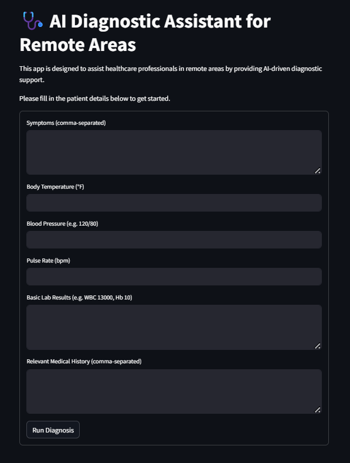

# 🩺 AI Diagnostic Assistant for Remote Areas

This project is a **Streamlit-based AI-powered diagnostic assistant** designed to support healthcare professionals in **remote or underserved areas**. By leveraging multiple intelligent agents and Google’s Gemini language model, this tool provides an AI-driven **differential diagnosis** based on patient data such as symptoms, vitals, lab results, and medical history.

---

## 🚀 Features

- **Intuitive Web Interface** built with Streamlit.
- **Multi-Agent Workflow** using [CrewAI](https://docs.crewai.com) for specialized medical data analysis.
- **Natural Language Diagnosis** powered by Google's Gemini model (via `litellm`).
- **Structured Diagnostic Summary** provided in both on-screen format and downloadable markdown.
- Clear, human-readable explanation of the diagnostic reasoning.
- Modular agents for:
  - Symptom analysis
  - Vital signs assessment
  - Lab report interpretation
  - Medical history evaluation
  - Follow-up recommendations

---

## 🧠 How It Works

1. **User Input**: Clinician inputs symptoms, vitals, lab results, and patient history.
2. **CrewAI Agents**: The app organizes and preprocesses the data using a structured team of specialized agents.
3. **Diagnosis Synthesis**: Agents collaboratively generate a comprehensive diagnosis and suggested follow-up.
4. **User Output**: A structured diagnostic summary and explanation are displayed and can be downloaded.

Each agent has a clear medical role (e.g., Symptom Interpreter, Vital Sign Analyzer) and contributes to a shared diagnostic objective using a shared memory pipeline orchestrated by `CrewAI`.

---

## 🛠️ Tech Stack

- **[Streamlit](https://streamlit.io/)** – for UI development
- **[CrewAI](https://crewai.com/)** – to simulate a team of expert AI agents
- **[LiteLLM](https://github.com/BerriAI/litellm)** – lightweight interface to use Gemini and other LLM APIs
- **Google Gemini API** – for large language model inference
- **Python** – core language for logic, orchestration, and data handling

---

## 🔮 Future Improvements

- 🧪 Add support for uploading detailed lab reports and medical images.
- 📊 Visualize diagnosis trends and graphs for better interpretation.
- 🔐 Add user authentication and patient data security layers.
- 🌍 Integrate offline capability or lightweight model for truly remote deployments.
- 🌐 Add multilingual support for better global usability.
- 📱 Package as a mobile-friendly PWA (Progressive Web App).

---

## ⚙️ Setup Instructions

### 🔧 Prerequisites

- Python 3.8+
- pip
- A valid [Google Gemini API key](https://aistudio.google.com/app/apikey)


### 📦 Installation

1. **Clone the Repository**
   ```bash
   git clone https://github.com/your-username/ai-diagnostic-assistant.git
   cd ai-diagnostic-assistant
   ```

2. **Create a Virtual Environment (optional but recommended)**
   ```bash
   python -m venv venv
   source venv\Scripts\activate
   ```

3. **Install Dependencies**
   ```bash
   pip install -r requirements.txt
   ```

4. **Add Your API Key**
   Replace the API key in `app.py` (GeminiLLM class) with your own [Google AI Studio](https://makersuite.google.com/) API key.


5. **Run the App**
   ```bash
   streamlit run app.py
   ```


---

## 📁 File Structure

```
ai-diagnostic-assistant/
│
├── diagnostic_app.py          # Main Streamlit app with CrewAI logic
├── requirements.txt           # Python dependencies
├── README.md                  # This file
```

---

## 📸 Demo Screenshot



---

## 📞 Contact

Built by **SRUJAN P R**  
Feel free to reach out for collaborations, ideas, or improvements.
Pull requests are welcome! If you’d like to improve the assistant or contribute new agents or features, feel free to fork the repo and submit a PR.

[LinkedIn](https://www.linkedin.com/in/srujanpr) • [Email](sruja2401@gmail.com)

---

## 📜 License

This project is licensed under the MIT License. See the LICENSE file for more details.

---

### 👨‍⚕️ Disclaimer

This tool is not a substitute for professional medical advice. It is designed to assist, not replace, qualified healthcare providers. Always consult a physician for serious or urgent medical concerns.

---

## ⭐ Star this repo if it helped you!
